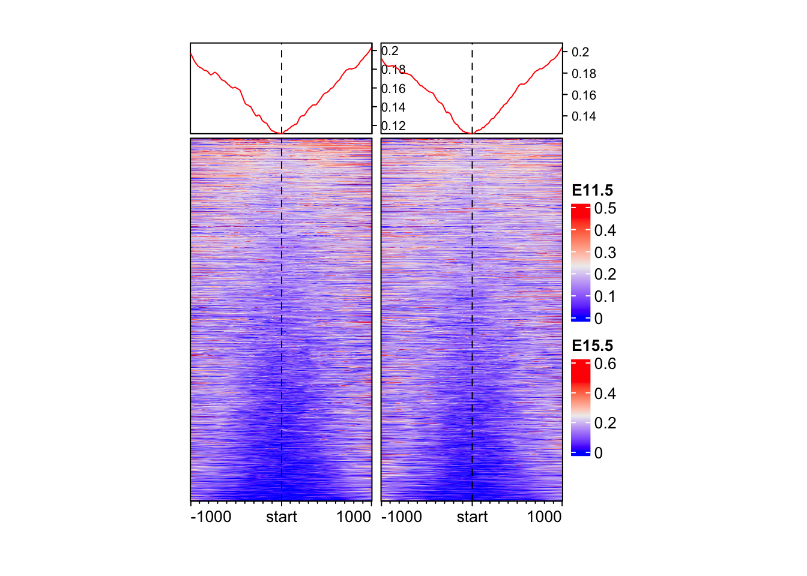

# Overlapping all the datasets

## Learning Objectives

By the end of this exercise, you will be able to:
- Load and explore genomic data using Bioconductor classes such as `GRangesList` and `RangedSummarizedExperiment`.
- Subset and filter genomic features based on annotation or genomic coordinates.
- Perform basic overlap and distance-based queries between genomic intervals.
- Integrate multi-assay data (e.g., chromatin marks and gene expression) using shared genomic coordinates.


## Load Libraries


::: {.cell}

```{.r .cell-code}
library(ComplexHeatmap)
library(EnrichedHeatmap)
library(SummarizedExperiment)
library(gUtils)
library(rtracklayer)
library(data.table)
library(parallel)
library(R.utils)
library(circlize)
```
:::


## SE objects

::: {.cell}

```{.r .cell-code}
atac <- readRDS("data/atac_se.rds")
rna <- readRDS("data/rna_se.rds")
h3k4me3 <- readRDS("data/h3k4me3_se.rds")
h3k4me1 <- readRDS("data/h3k4me1_se.rds")
h3k27me3 <- readRDS("data/h3k27me3_se.rds")
h3k27ac <- readRDS("data/h3k27ac_se.rds")
```
:::


## Overlap matrix

## Function to merge Genomic Ranges


::: {.cell}

```{.r .cell-code}
# Merge metadata from two GRanges objects based on overlaps
metaGR <- function(gr1, gr2, minOverlap = 1) {
  # Initialize metadata with gr1's metadata
  mcols_out <- mcols(gr1)

  # Find overlaps (keep all from gr1)
  hits <- findOverlaps(gr1, gr2, minoverlap = minOverlap)
  idx1 <- subjectHits(hits)
  idx2 <- queryHits(hits)

  # Prepare new metadata to be added
  new_mcols <- DataFrame(matrix(NA, nrow = length(gr1), ncol = ncol(mcols(gr2))))
  colnames(new_mcols) <- colnames(mcols(gr2))
  
  # Fill metadata only for overlaps
  new_mcols[idx2, ] <- mcols(gr2)[idx1, , drop = FALSE]

  # Combine original and new metadata
  mcols(gr1) <- cbind(mcols_out, new_mcols)
  
  return(gr1)
}
```
:::


## ATAC-Seq

::: {.cell}

```{.r .cell-code}
# Extract rowRanges and filter peaks with strong signal
rd_atac <- rowRanges(atac)
rd_atac <- rd_atac[abs(rd_atac$logFC) >= 0.5 & rd_atac$qvalue <= 0.1]
colnames(elementMetadata(rd_atac)) <- paste("ATAC", colnames(elementMetadata(rd_atac)), sep = "_")
```
:::


## RNA

::: {.cell}

```{.r .cell-code}
# Filter differentially expressed genes
rd_rna <- rowRanges(rna)
rd_rna <- rd_rna[abs(rd_rna$logFC) >= 0.5 & rd_rna$qvalue <= 0.1]
colnames(elementMetadata(rd_rna)) <- paste("RNA", colnames(elementMetadata(rd_rna)), sep = "_")
overlap <- metaGR(gr1 = rd_atac, gr2 = rd_rna, minOverlap = 10)
```
:::


## ChIP-Seq
### H3K4me3

::: {.cell}

```{.r .cell-code}
rd_h3k4me3 <- rowRanges(h3k4me3)
rd_h3k4me3 <- rd_h3k4me3[abs(rd_h3k4me3$logFC) >= 0.5 & rd_h3k4me3$qvalue <= 0.1]
colnames(elementMetadata(rd_h3k4me3)) <- paste("H3K4me3", colnames(elementMetadata(rd_h3k4me3)), sep = "_")
overlap <- metaGR(gr1 = overlap, gr2 = rd_h3k4me3, minOverlap = 10)
```
:::


### H3K4me1

::: {.cell}

```{.r .cell-code}
rd_h3k4me1 <- rowRanges(h3k4me1)
rd_h3k4me1 <- rd_h3k4me1[abs(rd_h3k4me1$logFC) >= 0.5 & rd_h3k4me1$qvalue <= 0.1]
colnames(elementMetadata(rd_h3k4me1)) <- paste("H3K4me1", colnames(elementMetadata(rd_h3k4me1)), sep = "_")
overlap <- metaGR(gr1 = overlap, gr2 = rd_h3k4me1, minOverlap = 10)
```

::: {.cell-output .cell-output-stderr}

```
Warning in .merge_two_Seqinfo_objects(x, y): Each of the 2 combined objects has sequence levels not in the other:
  - in 'x': chrY
  - in 'y': chr4_GL456216_random, chr4_JH584295_random, chrX_GL456233_random, chrUn_JH584304
  Make sure to always combine/compare objects based on the same reference
  genome (use suppressWarnings() to suppress this warning).
```


:::
:::


### H3K27me3

::: {.cell}

```{.r .cell-code}
rd_h3k27me3 <- rowRanges(h3k27me3)
rd_h3k27me3 <- rd_h3k27me3[abs(rd_h3k27me3$logFC) >= 0.5 & rd_h3k27me3$qvalue <= 0.1]
colnames(elementMetadata(rd_h3k27me3)) <- paste("H3K27me3", colnames(elementMetadata(rd_h3k27me3)), sep = "_")
overlap <- metaGR(gr1 = overlap, gr2 = rd_h3k27me3, minOverlap = 10)
```
:::


### H3K27ac

::: {.cell}

```{.r .cell-code}
rd_h3k27ac <- rowRanges(h3k27ac)
rd_h3k27ac <- rd_h3k27ac[abs(rd_h3k27ac$logFC) >= 0.5 & rd_h3k27ac$qvalue <= 0.1]
colnames(elementMetadata(rd_h3k27ac)) <- paste("H3K27ac", colnames(elementMetadata(rd_h3k27ac)), sep = "_")
overlap <- metaGR(gr1 = overlap, gr2 = rd_h3k27ac, minOverlap = 10)
```
:::


## Save data

::: {.cell}

```{.r .cell-code}
# Add a name field and save the final integrated object
overlap$name <- paste("peak", 1:length(overlap), sep = "_")
names(overlap) <- overlap$name

dir.create("output")
```

::: {.cell-output .cell-output-stderr}

```
Warning in dir.create("output"): 'output' already exists
```


:::

```{.r .cell-code}
saveRDS(object = overlap, file = "output/overlap_data.rds")
```
:::


### Snapshot of overlaMatrix

::: {.cell}

```{.r .cell-code}
overlap[1:3]
```

::: {.cell-output .cell-output-stdout}

```
GRanges object with 3 ranges and 109 metadata columns:
         seqnames          ranges strand |        ATAC_annotation ATAC_geneChr
            <Rle>       <IRanges>  <Rle> |            <character>    <integer>
  peak_1     chr1 3670547-3672665      * |       Promoter (<=1kb)            1
  peak_2     chr1 4332510-4332710      * | Intron (ENSMUST00000..            1
  peak_3     chr1 4491755-4492573      * |       Promoter (1-2kb)            1
         ATAC_geneStart ATAC_geneEnd ATAC_geneLength ATAC_geneStrand
              <integer>    <integer>       <integer>       <integer>
  peak_1        3214482      3671498          457017               2
  peak_2        4344146      4360314           16169               2
  peak_3        4492465      4493735            1271               2
         ATAC_geneId    ATAC_transcriptId ATAC_distanceToTSS       ATAC_ENSEMBL
         <character>          <character>          <numeric>        <character>
  peak_1      497097 ENSMUST00000070533.4                  0 ENSMUSG00000051951
  peak_2       19888 ENSMUST00000027032.5              27604 ENSMUSG00000025900
  peak_3       20671 ENSMUST00000191939.1               1162 ENSMUSG00000025902
         ATAC_SYMBOL          ATAC_GENENAME   ATAC_anno ATAC_logFC ATAC_logCPM
         <character>            <character> <character>  <numeric>   <numeric>
  peak_1        Xkr4 X-linked Kx blood gr..    Promoter   0.602984    10.45378
  peak_2         Rp1 retinitis pigmentosa..      Intron   0.855748     5.18424
  peak_3       Sox17 SRY (sex determining..    Promoter  -0.620926     7.13469
            ATAC_F ATAC_PValue ATAC_qvalue      RNA_Row.names RNA_gene_id
         <numeric>   <numeric>   <numeric>        <character> <character>
  peak_1  41.78446 6.58453e-08 4.81983e-07 ENSMUSG00000051951      497097
  peak_2   3.68371 6.13517e-02 9.28785e-02               <NA>        <NA>
  peak_3   9.14522 4.12368e-03 8.38540e-03               <NA>        <NA>
          RNA_SYMBOL           RNA_GENENAME        RNA_ENSEMBL RNA_geneLength
         <character>            <character>        <character>      <integer>
  peak_1        Xkr4 X-linked Kx blood gr.. ENSMUSG00000051951         457017
  peak_2        <NA>                   <NA>               <NA>           <NA>
  peak_3        <NA>                   <NA>               <NA>           <NA>
         RNA_geneChr RNA_geneStart RNA_geneEnd RNA_geneStrand  RNA_geneId
         <character>     <integer>   <integer>    <character> <character>
  peak_1        chr1       3214482     3671498              -      497097
  peak_2        <NA>          <NA>        <NA>           <NA>        <NA>
  peak_3        <NA>          <NA>        <NA>           <NA>        <NA>
             RNA_transcriptId    RNA_anno RNA_logFC RNA_logCPM     RNA_F
                  <character> <character> <numeric>  <numeric> <numeric>
  peak_1 ENSMUST00000070533.4        Gene   1.37498    5.62452   33.7077
  peak_2                 <NA>        <NA>        NA         NA        NA
  peak_3                 <NA>        <NA>        NA         NA        NA
         RNA_PValue RNA_qvalue H3K4me3_annotation H3K4me3_geneChr
          <numeric>  <numeric>        <character>       <integer>
  peak_1 0.00224273 0.00628871   Promoter (<=1kb)               1
  peak_2         NA         NA               <NA>            <NA>
  peak_3         NA         NA               <NA>            <NA>
         H3K4me3_geneStart H3K4me3_geneEnd H3K4me3_geneLength
                 <integer>       <integer>          <integer>
  peak_1           3214482         3671498             457017
  peak_2              <NA>            <NA>               <NA>
  peak_3              <NA>            <NA>               <NA>
         H3K4me3_geneStrand H3K4me3_geneId H3K4me3_transcriptId
                  <integer>    <character>          <character>
  peak_1                  2         497097 ENSMUST00000070533.4
  peak_2               <NA>           <NA>                 <NA>
  peak_3               <NA>           <NA>                 <NA>
         H3K4me3_distanceToTSS    H3K4me3_ENSEMBL H3K4me3_SYMBOL
                     <numeric>        <character>    <character>
  peak_1                     0 ENSMUSG00000051951           Xkr4
  peak_2                    NA               <NA>           <NA>
  peak_3                    NA               <NA>           <NA>
               H3K4me3_GENENAME H3K4me3_anno H3K4me3_logFC H3K4me3_logCPM
                    <character>  <character>     <numeric>      <numeric>
  peak_1 X-linked Kx blood gr..     Promoter      0.607114        9.26749
  peak_2                   <NA>         <NA>            NA             NA
  peak_3                   <NA>         <NA>            NA             NA
         H3K4me3_F H3K4me3_PValue H3K4me3_qvalue H3K4me1_annotation
         <numeric>      <numeric>      <numeric>        <character>
  peak_1   135.443    4.65079e-31    1.28968e-29               <NA>
  peak_2        NA             NA             NA               <NA>
  peak_3        NA             NA             NA               <NA>
         H3K4me1_geneChr H3K4me1_geneStart H3K4me1_geneEnd H3K4me1_geneLength
               <integer>         <integer>       <integer>          <integer>
  peak_1            <NA>              <NA>            <NA>               <NA>
  peak_2            <NA>              <NA>            <NA>               <NA>
  peak_3            <NA>              <NA>            <NA>               <NA>
         H3K4me1_geneStrand H3K4me1_geneId H3K4me1_transcriptId
                  <integer>    <character>          <character>
  peak_1               <NA>           <NA>                 <NA>
  peak_2               <NA>           <NA>                 <NA>
  peak_3               <NA>           <NA>                 <NA>
         H3K4me1_distanceToTSS H3K4me1_ENSEMBL H3K4me1_SYMBOL H3K4me1_GENENAME
                     <numeric>     <character>    <character>      <character>
  peak_1                    NA            <NA>           <NA>             <NA>
  peak_2                    NA            <NA>           <NA>             <NA>
  peak_3                    NA            <NA>           <NA>             <NA>
         H3K4me1_anno H3K4me1_logFC H3K4me1_logCPM H3K4me1_F H3K4me1_PValue
          <character>     <numeric>      <numeric> <numeric>      <numeric>
  peak_1         <NA>            NA             NA        NA             NA
  peak_2         <NA>            NA             NA        NA             NA
  peak_3         <NA>            NA             NA        NA             NA
         H3K4me1_qvalue H3K27me3_annotation H3K27me3_geneChr H3K27me3_geneStart
              <numeric>         <character>        <integer>          <integer>
  peak_1             NA                <NA>             <NA>               <NA>
  peak_2             NA                <NA>             <NA>               <NA>
  peak_3             NA    Promoter (<=1kb)                1            4492465
         H3K27me3_geneEnd H3K27me3_geneLength H3K27me3_geneStrand
                <integer>           <integer>           <integer>
  peak_1             <NA>                <NA>                <NA>
  peak_2             <NA>                <NA>                <NA>
  peak_3          4493735                1271                   2
         H3K27me3_geneId H3K27me3_transcriptId H3K27me3_distanceToTSS
             <character>           <character>              <numeric>
  peak_1            <NA>                  <NA>                     NA
  peak_2            <NA>                  <NA>                     NA
  peak_3           20671  ENSMUST00000191939.1                      0
           H3K27me3_ENSEMBL H3K27me3_SYMBOL      H3K27me3_GENENAME
                <character>     <character>            <character>
  peak_1               <NA>            <NA>                   <NA>
  peak_2               <NA>            <NA>                   <NA>
  peak_3 ENSMUSG00000025902           Sox17 SRY (sex determining..
         H3K27me3_anno H3K27me3_logFC H3K27me3_logCPM H3K27me3_F
           <character>      <numeric>       <numeric>  <numeric>
  peak_1          <NA>             NA              NA         NA
  peak_2          <NA>             NA              NA         NA
  peak_3      Promoter        -1.0597         9.04668    87.0802
         H3K27me3_PValue H3K27me3_qvalue H3K27ac_annotation H3K27ac_geneChr
               <numeric>       <numeric>        <character>       <integer>
  peak_1              NA              NA   Promoter (<=1kb)               1
  peak_2              NA              NA               <NA>            <NA>
  peak_3     1.32026e-20     5.28858e-18               <NA>            <NA>
         H3K27ac_geneStart H3K27ac_geneEnd H3K27ac_geneLength
                 <integer>       <integer>          <integer>
  peak_1           3214482         3671498             457017
  peak_2              <NA>            <NA>               <NA>
  peak_3              <NA>            <NA>               <NA>
         H3K27ac_geneStrand H3K27ac_geneId H3K27ac_transcriptId
                  <integer>    <character>          <character>
  peak_1                  2         497097 ENSMUST00000070533.4
  peak_2               <NA>           <NA>                 <NA>
  peak_3               <NA>           <NA>                 <NA>
         H3K27ac_distanceToTSS    H3K27ac_ENSEMBL H3K27ac_SYMBOL
                     <numeric>        <character>    <character>
  peak_1                     0 ENSMUSG00000051951           Xkr4
  peak_2                    NA               <NA>           <NA>
  peak_3                    NA               <NA>           <NA>
               H3K27ac_GENENAME H3K27ac_anno H3K27ac_logFC H3K27ac_logCPM
                    <character>  <character>     <numeric>      <numeric>
  peak_1 X-linked Kx blood gr..     Promoter       1.25269        8.81735
  peak_2                   <NA>         <NA>            NA             NA
  peak_3                   <NA>         <NA>            NA             NA
         H3K27ac_F H3K27ac_PValue H3K27ac_qvalue        name
         <numeric>      <numeric>      <numeric> <character>
  peak_1   151.496    1.67395e-34     4.0813e-32      peak_1
  peak_2        NA             NA             NA      peak_2
  peak_3        NA             NA             NA      peak_3
  -------
  seqinfo: 21 sequences from an unspecified genome; no seqlengths
```


:::
:::


# Normalized metrics for plotting

## Taking 1000 bp around the mid of ATAC-peaks

::: {.cell}

```{.r .cell-code}
# Extract midpoints of peaks to create windows for visualization
mid_peaks <- gr.mid(overlap)
```
:::


## ATAC

::: {.cell}

```{.r .cell-code}
# Load ATAC bigWig files
atac_files <- list.files("data", pattern = "ATAC", full.names = TRUE)
names(atac_files) <- gsub(pattern = "\\.bw", replacement = "", x = basename(atac_files))
atac_bw <- lapply(atac_files, function(x){
  a <- rtracklayer::import(x)
  a <- a[seqnames(a) %in% c("chr1", "chr2")]
  a
})

# Normalize signal around mid_peaks
mat_AS <- lapply(atac_bw, FUN = function(x) {
  normalizeToMatrix(x, mid_peaks,
    extend = 1000,
    value_column = "score",
    include_target = TRUE,
    mean_mode = "w0",
    w = 20, 
    smooth = T,
    background = 0
  )
})
```

::: {.cell-output .cell-output-stderr}

```
Warning: Width of `target` are all 1, `include_target` is set to `FALSE`.
Warning: Width of `target` are all 1, `include_target` is set to `FALSE`.
```


:::

```{.r .cell-code}
saveRDS(mat_AS, file = "output/mat_atac.rds")
```
:::


## ChIP

### H3K4me3

::: {.cell}

```{.r .cell-code}
h3k4me3_files <- list.files("data", pattern = "H3K4me3", full.names = TRUE)
names(h3k4me3_files) <- gsub(pattern = "\\.bw", replacement = "", x = basename(h3k4me3_files))
h3k4me3_bw <- lapply(h3k4me3_files, function(x){
  a <- rtracklayer::import(x)
  a <- a[seqnames(a) %in% c("chr1", "chr2")]
  a
})

mat_h3k4me3 <- lapply(h3k4me3_bw, FUN = function(x) {
  normalizeToMatrix(x, mid_peaks,
    extend = 1000,
    value_column = "score",
    include_target = TRUE,
    mean_mode = "w0",
    w = 20,
    smooth = T,
    background = 0
  )
})
```

::: {.cell-output .cell-output-stderr}

```
Warning: Width of `target` are all 1, `include_target` is set to `FALSE`.
Warning: Width of `target` are all 1, `include_target` is set to `FALSE`.
```


:::

```{.r .cell-code}
saveRDS(mat_h3k4me3, file = "output/mat_h3k4me3.rds")
```
:::


### H3K4me1

::: {.cell}

```{.r .cell-code}
h3k4me1_files <- list.files("data", pattern = "H3K4me1", full.names = TRUE)
names(h3k4me1_files) <- gsub(pattern = "\\.bw", replacement = "", x = basename(h3k4me1_files))
h3k4me1_bw <- lapply(h3k4me1_files, function(x){
  a <- rtracklayer::import(x)
  a <- a[seqnames(a) %in% c("chr1", "chr2")]
  a
})

mat_h3k4me1 <- lapply(h3k4me1_bw, FUN = function(x) {
  normalizeToMatrix(x, mid_peaks,
    extend = 1000,
    value_column = "score",
    include_target = TRUE,
    mean_mode = "w0",
    w = 20,
    smooth = T,
    background = 0
  )
})
```

::: {.cell-output .cell-output-stderr}

```
Warning: Width of `target` are all 1, `include_target` is set to `FALSE`.
Warning: Width of `target` are all 1, `include_target` is set to `FALSE`.
```


:::

```{.r .cell-code}
saveRDS(mat_h3k4me1, file = "output/mat_h3k4me1.rds")
```
:::


### H27K4me3

::: {.cell}

```{.r .cell-code}
h3k27me3_files <- list.files("data", pattern = "H3K27me3", full.names = TRUE)
names(h3k27me3_files) <- gsub(pattern = "\\.bw", replacement = "", x = basename(h3k27me3_files))
h3k27me3_bw <- lapply(h3k27me3_files, function(x){
  a <- rtracklayer::import(x)
  a <- a[seqnames(a) %in% c("chr1", "chr2")]
  a
})

mat_h3k27me3 <- lapply(h3k27me3_bw, FUN = function(x) {
  normalizeToMatrix(x, mid_peaks,
    extend = 1000,
    value_column = "score",
    include_target = TRUE,
    mean_mode = "w0",
    w = 20,
    smooth = T,
    background = 0
  )
})
```

::: {.cell-output .cell-output-stderr}

```
Warning: Width of `target` are all 1, `include_target` is set to `FALSE`.
Warning: Width of `target` are all 1, `include_target` is set to `FALSE`.
```


:::

```{.r .cell-code}
saveRDS(mat_h3k27me3, file = "output/mat_h3k27me3.rds")
```
:::


### H27K4ac

::: {.cell}

```{.r .cell-code}
h3k27ac_files <- list.files("data", pattern = "H3K27ac", full.names = TRUE)
names(h3k27ac_files) <- gsub(pattern = "\\.bw", replacement = "", x = basename(h3k27ac_files))
h3k27ac_bw <- lapply(h3k27ac_files, function(x){
  a <- rtracklayer::import(x)
  a <- a[seqnames(a) %in% c("chr1", "chr2")]
  a
})

mat_h3k27ac <- lapply(h3k27ac_bw, FUN = function(x) {
  normalizeToMatrix(x, mid_peaks,
    extend = 1000,
    value_column = "score",
    include_target = TRUE,
    mean_mode = "w0",
    w = 20,
    smooth = T,
    background = 0
  )
})
```

::: {.cell-output .cell-output-stderr}

```
Warning: Width of `target` are all 1, `include_target` is set to `FALSE`.
Warning: Width of `target` are all 1, `include_target` is set to `FALSE`.
```


:::

```{.r .cell-code}
saveRDS(mat_h3k27ac, file = "output/mat_h3k27ac.rds")
```
:::


## RNA

::: {.cell}

```{.r .cell-code}
# Match overlapping peak names with RNA-seq gene names
tmp <- elementMetadata(overlap)[,c("RNA_Row.names", "name")]

# Get logCPM matrix
counts <- assay(rna, "logCPM")
counts <- assay(rna, "logCPM") - rowMeans(
  assay(rna, "logCPM")[, grep(pattern = "11half", x = colnames(assay(rna, "logCPM")),
                              value = T)]
)

# Merge gene expression values with peaks
mat_RNA <- merge(tmp, counts, by.x = "RNA_Row.names", by.y = "row.names", all.x = T)

# Set rownames to peak names and cleanup
rownames(mat_RNA) <- mat_RNA$name
mat_RNA <- mat_RNA[,-c(1:2)]
colnames(mat_RNA) <- gsub(pattern = ".tsv.gz", replacement = "", x = colnames(mat_RNA))
mat_RNA <- data.matrix(mat_RNA)
mat_RNA <- mat_RNA[names(overlap),]

# Save data
saveRDS(mat_RNA, file = "output/mat_rna.rds")
```
:::


## WGBS

::: {.cell}

```{.r .cell-code}
# Bisulfite seq coverage files after methylation call
bs_files <- list.files("data", pattern = "WGBS", full.names = TRUE)
names(bs_files) <- gsub(pattern = "\\.bed.gz", replacement = "", x = basename(bs_files))

# Reading coverage
bs_cov <- lapply(bs_files, function(x) {
  GRanges(  
  fread(
      input = x,
      sep = " ", quote = F, stringsAsFactors = F,
      data.table = FALSE, nThread = parallel::detectCores(), showProgress = F,
      col.names = c("seqnames", "start", "end", "cov", "Me", "Un", "meth")
    )
  )
})

# Normalized matrics
mat_bs <- lapply(bs_cov, FUN = function(x) {
    normalizeToMatrix(x, mid_peaks,
      extend = 1000,
      value_column = "meth",
      include_target = TRUE,
      smooth = TRUE,
      mean_mode = "absolute",
      background = NA
    )
})
```

::: {.cell-output .cell-output-stderr}

```
Warning: Width of `target` are all 1, `include_target` is set to `FALSE`.
```


:::

::: {.cell-output .cell-output-stderr}

```
Warning: Smoothing is failed for one row because there are very few signals
overlapped to it. Please use `failed_rows(mat)` to get the index of the
failed row and consider to remove it.
```


:::

::: {.cell-output .cell-output-stderr}

```
Warning: Width of `target` are all 1, `include_target` is set to `FALSE`.
```


:::

::: {.cell-output .cell-output-stderr}

```
All signal values are within [0, 1], so we assume it is methylation
signal. Automatically set limit [0, 1] to the smoothed values. If this
is not the case, set argument `limit = NA` in the function to remove
the limits. Set `verbose = FALSE` to turn off this message.
```


:::

::: {.cell-output .cell-output-stderr}

```
Warning: Smoothing is failed for one row because there are very few signals
overlapped to it. Please use `failed_rows(mat)` to get the index of the
failed row and consider to remove it.
```


:::

```{.r .cell-code}
saveRDS(mat_bs, file = "output/mat_bs.rds")
```
:::


## Question 1
**Make an `EnrichedHeatmap`** of methylation data.

:::{.callout-tip collapse="true"}

::: {.cell}

```{.r .cell-code}
EnrichedHeatmap(
  mat = mat_bs$WGBS_11half,    # normalized matrix
  name = "E11.5",              # Name for the plot
  width = unit(4, "cm"),       # Width of the heatmap
  height = unit(8, "cm")      # Height of the heatmap
) + EnrichedHeatmap(
  mat = mat_bs$WGBS_15half,    # normalized matrix
  name = "E15.5",              # Name for the plot
  width = unit(4, "cm"),       # Width of the heatmap
  height = unit(8, "cm")      # Height of the heatmap
)
```

::: {.cell-output .cell-output-stderr}

```
The automatically generated colors map from the 1^st and 99^th of the
values in the matrix. There are outliers in the matrix whose patterns
might be hidden by this color mapping. You can manually set the color
to `col` argument.

Use `suppressMessages()` to turn off this message.
The automatically generated colors map from the 1^st and 99^th of the
values in the matrix. There are outliers in the matrix whose patterns
might be hidden by this color mapping. You can manually set the color
to `col` argument.

Use `suppressMessages()` to turn off this message.
```


:::

::: {.cell-output-display}
{width=672}
:::
:::


:::

:::{.callout-important}
We have not performed differential analysis for DNA methylation data. If you want, you can. Here, we are using DNA methylation as an observartory mark.
:::

